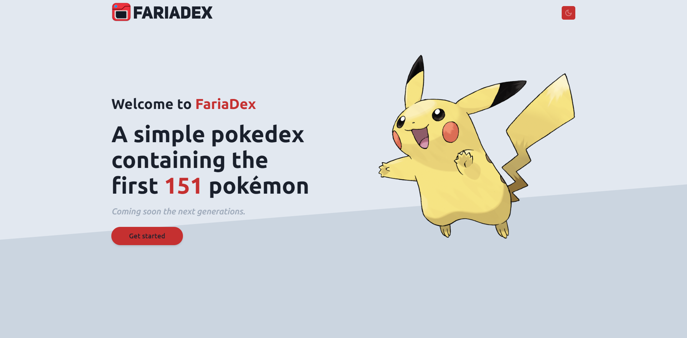

<h1 align="center">
    
    FariaDex
</h1>

<h1 align="center">
    
    
    
</h1>

<h2 align="center">Live Demo: https://faria-dex.vercel.app/ </h2>

## 💻 Project

A pokedex initially containing the first 151 Pokémon with their detailed information.
 
I used [PokeAPI](https://pokeapi.co/) to create this app.

## 🚀 Techs

This project was built with:

 [Typescript](https://www.typescriptlang.org/)
 
 
 [React](https://reactjs.org) 
 
 
 [Next](https://nextjs.org/)
 
 
 [Styled Components](https://styled-components.com/)
